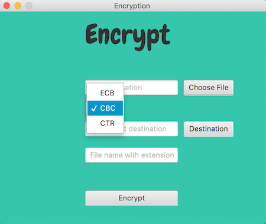

# javafx-encryption-app
a javafx application that performs AES encryption on a selected file

 

Encrypt Window             |  Decrypt Window
:-------------------------:|:-------------------------:
  |  

## summary
* The user chooses a file to be encrypted and mode of encryption
* A copy of the specified file is encrypted and placed in the chosen destination
* File is stored with a SecureRandom generated key and IV
